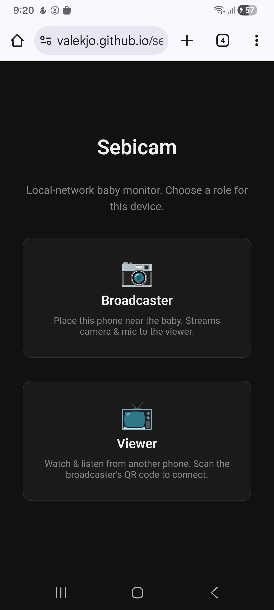
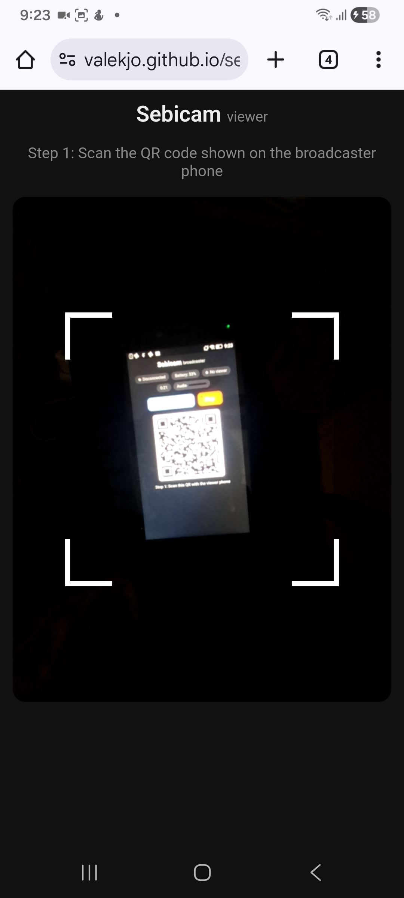
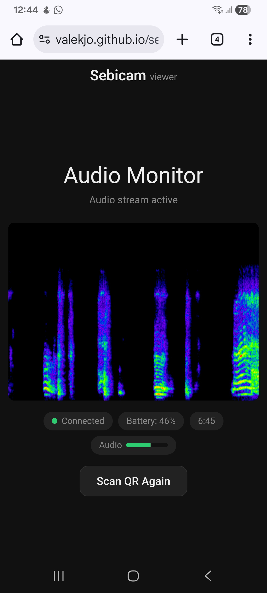

# Sebicam

Local-network baby monitor. Phone A broadcasts encrypted audio via WebRTC; Phone B listens in a browser. Signaling is done by scanning QR codes between the two phones — the server only serves static files. Media flows peer-to-peer.



## Try It

The app is hosted at **https://valekjo.github.io/sebicam** — open it on both phones and follow the usage steps below.

To use it without internet: open the link once on each phone to cache it, then save it to your home screen. One phone can act as a Wi-Fi hotspot for the other — the entire setup works offline since signaling is done via QR codes and media flows directly between the phones.

## Development

```bash
npm install
npm run generate-cert   # one-time: generates self-signed TLS cert in certs/
npm run dev             # starts HTTPS server on port 3000
```

Open the printed Network URL (e.g. `https://192.168.1.x:3000`) on both phones. Accept the certificate warning on each device.

## Usage

### Phone A — Broadcaster

1. Open the app and choose **Broadcaster**
2. Allow microphone access
3. Tap **Start** — a QR code appears
4. Have Phone B scan this QR code
5. Tap **Scan Response** to scan Phone B's answer QR code
6. Audio streaming begins once both QR codes are exchanged

### Phone B — Viewer

1. Open the app and choose **Viewer**
2. Scan the QR code shown on Phone A
3. A response QR code appears — show it to Phone A to scan
4. Audio from Phone A starts playing, with a live spectrogram






## Architecture

```
Phone A (Broadcaster) ----QR codes----> Phone B (Viewer)
         \                                    /
          ======= WebRTC P2P (encrypted) ====
```

- **Server**: HTTPS static file server only — no signaling logic
- **Signaling**: Two-way QR code exchange between phones (no server involvement)
- **Transport**: WebRTC peer-to-peer with DTLS-SRTP encryption
- **Audio only**: no video streaming

### Two-phase connection

The connection uses a two-phase handshake:

1. **QR-based bootstrap** — Compact binary-encoded SDPs (`SBC1:` format) exchanged via QR codes establish a WebRTC data channel
2. **Full SDP over data channel** — Once the data channel opens, full browser-generated SDPs are exchanged over it to negotiate audio codecs properly

This design exists because QR-encoded SDPs are too compact to represent all codec/extension details browsers need. The QR exchange only bootstraps connectivity; real media negotiation happens over the data channel.

## Features

- **Dark theme** — designed for nighttime use
- **Audio spectrogram** — real-time frequency visualization on the viewer
- **Battery status** — broadcaster's battery level shown on both phones
- **Audio level meter** — visual indicator of sound in the room
- **Stream duration** — elapsed time counter
- **Keep-alive** — Wake Lock + silent audio oscillator + Media Session API to prevent the broadcaster from sleeping
- **Offline support** — service worker caches all assets for PWA-like usage
- **Secure by default** — HTTPS required, WebRTC media encrypted via DTLS-SRTP

## Requirements

- Node.js 24+ (see `.nvmrc`)
- Both phones on the same local network
- openssl (for certificate generation)

## Limitations

- LAN only — no TURN server, so it won't work across different networks
- Single viewer per session
- Self-signed certificate requires manually accepting the browser warning on each device
